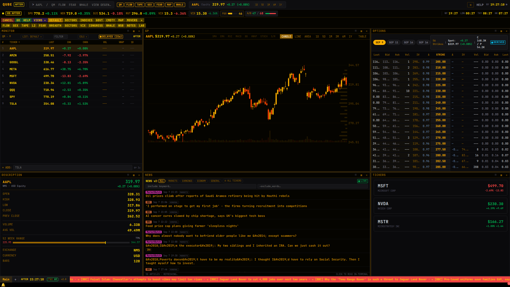
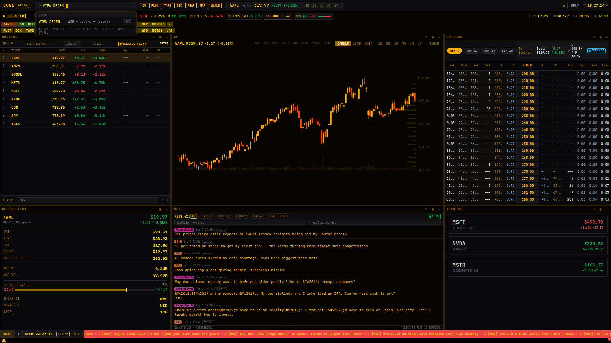
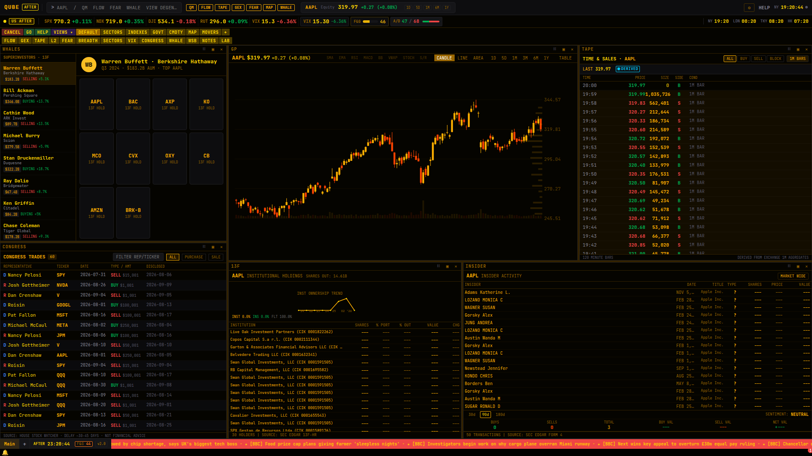
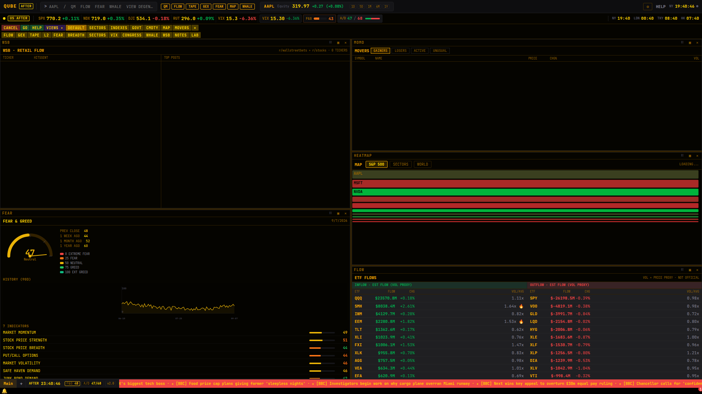
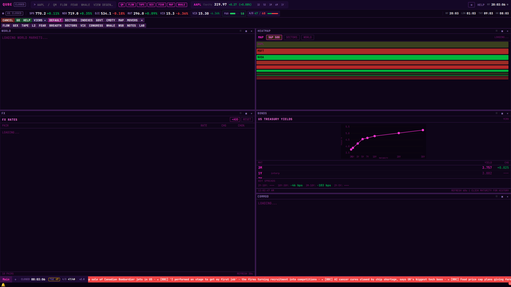

# QUBE Terminal

> **A Bloomberg-style markets terminal that runs entirely in your browser.**
> 57 tiled panels, a natural-language command bar, a tiling window manager with color-coded link groups, an AI analyst that can drive the UI, and zero paid data feeds.

<p align="center">
  
</p>

QUBE is a keyboard-first, amber-on-black research terminal for equities, options, FX, commodities, and fixed income. Everything is tiled — quotes, charts, options chains, news, filings, ownership intel — and every panel is coordinated through Bloomberg-style **color link groups**: change the instrument in one amber-linked panel and every other amber panel follows.

- **No API keys required** — market data flows through server-side routes proxying free, public sources (Yahoo Finance, SEC EDGAR, Nasdaq, RSS wires, Reddit, CNN, …)
- **No backend to run** — it's a single Next.js app; persistence is local-first (IndexedDB with localStorage fallback)
- **No UI framework** — custom design-token theming, pure SVG charts, hand-rolled tiling window manager

---

## Table of contents

- [Quick start](#quick-start)
- [The 60-second tour](#the-60-second-tour)
- [Workspaces & layouts](#workspaces--layouts)
- [Command bar](#command-bar)
- [Keyboard-first workflow](#keyboard-first-workflow)
- [Panel catalog](#panel-catalog)
- [AI Brain](#ai-brain)
- [Theming](#theming)
- [Streaming & data integrity](#streaming--data-integrity)
- [Data sources](#data-sources)
- [Architecture](#architecture)
- [Testing](#testing)
- [Project structure](#project-structure)
- [Notes & disclaimers](#notes--disclaimers)

---

## Quick start

```bash
# Node 20+ and pnpm 10
pnpm install
pnpm dev          # http://localhost:3000
```

Production:

```bash
pnpm build
pnpm start
```

> **Note:** `next.config.ts` uses `output: 'standalone'`. When self-hosting the standalone bundle, copy `.next/static` into `.next/standalone/.next/static` (and `public/` if present) before running `node .next/standalone/server.js`. On Vercel this is handled for you.

First launch opens a short welcome tour; hit **Skip — just start trading** to dive straight in. Every panel works out of the box — the AI Brain is the only opt-in feature (bring your own key, see [AI Brain](#ai-brain)).

---

## The 60-second tour

| | |
|---|---|
|  | **⌘K command bar.** Type `NVDA GP` to chart Nvidia, `VIEW DEGEN` to load a preset, `ALERT TSLA ABOVE 400`, or `ADD 10 MSFT 320` to log a position. Autocomplete knows every mnemonic. |
|  | **WHALE workspace.** Superinvestor 13F moves, congressional trading, institutional holdings, insider activity — with the chart, tape, and Level 2 alongside. |
|  | **DEGEN workspace.** The Fear & Greed gauge with its factor breakdown, ETF flow tracker, and the S&P 500 heatmap — retail sentiment at a glance. |
|  | **Theming.** One click in Settings swaps the entire shell — here Cyberpunk (neon magenta on deep violet) over the MARKETS workspace. |

---

## Workspaces & layouts

QUBE ships **16 layout presets** — full tiling arrangements curated per workflow. Load them from the **VIEWS ▾** strip, the command bar (`VIEW <id>`), or the settings gallery.

| Preset | `VIEW <id>` | Focus |
|---|---|---|
| `GODEL` | `view godel` | Sleek 3-column default: monitor, chart, options, description, news, tickers |
| `DENSE` | `view dense` | Maximum information density |
| `TRADER` | `view trader` | Classic trader workspace |
| `WHALE` | `view whale` | Superinvestors + congress + institutional |
| `FLOW` | `view flow` | Options flow + gamma + tape |
| `FEAR` | `view fear` | Fear & Greed + VIX + breadth + WSB |
| `SQUEEZE` | `view squeeze` | Movers + depth + GEX squeeze detector |
| `TAPE` | `view tape` | Tape reading + Level 2 + chart |
| `EARN` | `view earn` | Earnings + seasonality + fundamentals |
| `JOURNAL` | `view journal` | Trading journal + backtest lab |
| `DEGEN` | `view degen` | WSB + Fear + Movers + Heatmap |
| `NEWS` | `view news` | News & macro focus |
| `ANALYSIS` | `view analysis` | Deep fundamental analysis |
| `MARKETS` | `view markets` | Global markets overview |
| `SCREEN` | `view screening` | Stock screening workspace |
| `AI` | `view ai` | AI-powered analysis workspace |

On top of presets you get a full **tiling window manager**: drag panes, double-click a title bar to maximize, split horizontally/vertically, resize with `⌘⇧`+arrows, swap panes (`⌘⇧H/J/K/L`), right-click for the pane context menu, and save any arrangement as a named **workspace** you can restore later (`WORKSPACE SAVE my-setup`).

### Color link groups

Panels join **RED / YELLOW / GREEN / BLUE / MAGENTA / CYAN** link groups (or `UNLINKED`). Selecting a ticker in any linked panel re-targets every panel in that group — the same coordination model Bloomberg terminals use. Function keys at the top of the shell provide Bloomberg-style quick actions (`GOVT`, `CMDTY`, `MAP`, `MOVERS`, `FLOW`, `GEX`, `TAPE`, `L2`, `FEAR`, `BREADTH`, `CONGRESS`, `WHALE`, `WSB`, `NOTES`, `LAB`…).

---

## Command bar

Press **⌘K** (or click the input) and type. The grammar is Bloomberg-flavored:

```
NVDA GP                     instrument-first: chart Nvidia
AAPL US EQUITY DES          fully-qualified instrument + panel
AAPL 260515 C 200           single option chain lookup
VIEW DEGEN                  load a layout preset
ALERT TSLA ABOVE 400        create a price alert
ADD 10 MSFT 320             log 10 shares @ $320 cost basis
WATCHLIST CREATE memes      new custom watchlist
WORKSPACE SAVE my-setup     persist current tiling layout
XL                          export the active watchlist
BRAIN                       open the AI analyst
```

Commands are declared in a single typed registry (`src/lib/commands/command-registry.ts`) that drives the parser, autocomplete, the auto-generated HELP panel, and the AI Brain's tool catalog — one source of truth, no drift.

---

## Keyboard-first workflow

| Keys | Action |
|---|---|
| `⌘K` | Focus command bar |
| `?` | Shortcut & command reference overlay |
| `Tab` | Cycle pane focus |
| `⌘H J K L` | Move focus (vim-style) |
| `⌘⇧H J K L` | Swap active pane |
| `⌘⇧← ↑ → ↓` | Resize active split |
| `⌘M` / `⌘W` | Maximize / close active pane |
| `⌘B` | Open Brain chat |
| `⌘E` | Export watchlist CSV |
| `⌘⇧A` | Create price alert |
| `1–9` | Select watchlist ticker |
| `J / K` | Scroll active pane |
| `Esc` | Restore / close overlay |

The status bar runs four world clocks (NY / LDN / TKY / HK), live session state (pre-market / open / after-hours), and a market-pulse strip with SPX, NDX, DJI, RUT, VIX and the CNN Fear & Greed index. A breaking-news banner drops in from the wire when headlines break, and a notification center collects alert triggers.

---

## Panel catalog

**57 panel types**, all loadable into any tile:

| Area | Panels |
|---|---|
| **Quotes & charts** | Quote monitor, ticker cards, interactive chart (SMA, EMA, RSI, MACD, Bollinger, VWAP, ATR, stochastic, Williams %R, Ichimoku, Fibonacci, volume), Level 2 depth, time & sales tape, historical data table, security description, all-quotes |
| **Market overview** | Market heatmap (SVG treemap), world markets, movers, market breadth, sector rotation, Fear & Greed, VIX term structure, market halts, economic calendar, commodities, FX rates, Treasury yields |
| **Options & flow** | Options chain, unusual options flow, gamma exposure (GEX), options valuation, ETF flows |
| **Company research** | Fundamentals, earnings, earnings matrix, analyst ratings, transcripts, SEC filings & filing viewer, insider activity, financial analysis, ratio analysis, financial statements, dividend calendar & analytics, seasonality, IPO monitor, financial calculator |
| **Ownership & sentiment** | Superinvestors, institutional holdings, congress trades, WSB trending, social sentiment, AUM |
| **AI & research** | Brain chat, Brain settings, finance research, research notes, trading journal, backtest lab |
| **Workspace** | Portfolio, stock screener, correlation & risk, news feed (v2, filterable), help, workspace manager |

Every panel is draggable, splittable, maximizable, link-group aware, and exports what it shows (CSV / JSON / XLSX).

---

## AI Brain

The **Brain** is an AI analyst embedded in the terminal (open it with `⌘B` or the `BRAIN` command). It doesn't just chat — it has **tool access to the shell**: it can open panels, load presets, compare instruments side-by-side, and run comparative workflows while it answers.

- **Bring your own key** — configured in *Brain Settings* and stored client-side; requests are relayed per-call by the server route. Nothing is hardcoded server-side.
- **Providers** — Anthropic, OpenAI, and OpenRouter for chat; Perplexity backs the finance research / cited-search workflow.
- **Guardrails** — destructive tools (`close_panel`, `load_preset`, `load_workspace`) are gated behind an explicit permission set.

Without a key, every other panel keeps working — the Brain is fully opt-in.

---

## Theming

Five built-in themes with a full semantic design-token system (`src/lib/design-tokens.ts`), plus a custom accent override:

| Theme | Look |
|---|---|
| **Classic Amber** | The original amber-on-black terminal |
| **Cyberpunk** | Neon magenta on deep violet |
| **Blueprint** | Cyan on midnight blue |
| **Midnight** | Soft periwinkle on ink |
| **Solarized** | Teal on solarized dark |

Respects `prefers-reduced-motion` across all animations.

---

## Streaming & data integrity

- **SSE streaming gateway** (`/api/v2/stream`) multiplexes client topic subscriptions (`quotes:AAPL`, …) into a server-side poll fan-out with heartbeats and deltas; the client falls back automatically from WebSocket to SSE.
- **No synthetic data.** Topics that require real exchange entitlements (trades, depth) are **never fabricated** — the gateway emits an explicit `UNAVAILABLE` marker so panels label themselves honestly (you'll see the `DELAYED` / `DERIVED` badges in the UI).
- **Canonical security master** — a resolver normalizes symbols, multipliers, and instrument types across providers so panels never disagree about identity.
- **Provider registry with fallbacks** — when an upstream fails, panels degrade to the next source instead of breaking.

---

## Data sources

All upstreams are free and public; every call is proxied server-side through Next.js route handlers to dodge CORS and keep the client clean.

| Source | Feeds |
|---|---|
| Yahoo Finance | Quotes, charts, options, screeners, movers, breadth, heatmap, fundamentals |
| SEC EDGAR (`data.sec.gov`, `efts.sec.gov`) | Filings, XBRL company facts, full-text search |
| Nasdaq API | Options, transcripts, statements |
| RSS wires | CNBC, MarketWatch, NYT Business, BBC, ZeroHedge |
| Reddit | WSB trending / sentiment |
| CNN / Fear & Greed | Market sentiment gauge |
| `faireconomy.media` | Economic calendar |
| House Stock Watcher | Congressional trading disclosures |
| stockanalysis.com, Seeking Alpha | Reference data, statements, transcripts |

---

## Architecture

- **Next.js 15 App Router + React 19 + TypeScript**, zero component libraries — all UI is hand-built on a semantic design-token system.
- **Custom tiling window manager** (`src/lib/tiling-*`, `src/context/tiling-context.tsx`): a binary tree of splits with drag, resize, swap, maximize, presets, and persisted workspaces.
- **One command registry** powers the parser, autocomplete, HELP panel, and the AI tool catalog.
- **Server-side data layer** — 107 route handlers under `src/app/api/*` proxy and normalize upstreams; a provider registry handles fallbacks; math (Greeks, indicators, risk) lives in pure, tested modules (`src/lib/indicators.ts`, `src/lib/math/`, `src/lib/risk-math.ts`).
- **Local-first persistence** — IndexedDB (localStorage fallback) via a storage manager with migrations: workspaces, watchlists, portfolios, notes, alerts, preferences.
- **Deploys cleanly to Vercel** (`@vercel/analytics` wired up).

## Testing

```bash
pnpm test          # vitest run
pnpm test:watch
```

Vitest suites across four layers:

| Suite | Covers |
|---|---|
| `tests/unit` | Command parser, security-master resolver, financial math, options Greeks, storage migrations, link-group reducer |
| `tests/integration` | Provider fallback chains |
| `tests/ui` | Tiling workspace behavior |
| `tests/adversarial` | Stress/fuzz-style abuse of parsers and storage |

---

## Project structure

```
src/
├── app/                  # Next.js App Router
│   ├── api/              # Server-side data routes (yfin, godel, sec, rss, brain, v2/stream, …)
│   └── page.tsx          # Single-page terminal shell
├── components/
│   ├── panels/           # 57 tiling panels
│   ├── shell/            # Command bar, function keys, status bar, banners, modals
│   ├── tiling/           # Window-manager chrome (title bars, resizers, context menu)
│   └── modals/           # Security finder, workspace manager
├── context/              # Terminal + tiling React contexts
└── lib/
    ├── commands/         # Command registry + parser (single source of truth)
    ├── streaming/        # SSE/WS stream client
    ├── providers/        # Upstream provider contracts + fallbacks
    ├── security-master/  # Canonical instrument resolver
    ├── persistence/      # IndexedDB storage manager + migrations
    ├── workspaces/       # Save/load/duplicate layouts
    ├── math/             # Financial math, options pricing
    ├── indicators.ts     # TA library (SMA/EMA/RSI/MACD/Bollinger/Ichimoku/…)
    └── themes.ts         # Theme + design tokens
tests/                    # Vitest: unit / integration / ui / adversarial
```

---

## Notes & disclaimers

- Market data comes from free public sources with varying delay and reliability (badges in the UI tell you which). **Not a brokerage — no order execution, no accounts, no auth.** QUBE is a research and monitoring surface.
- Not investment advice.
